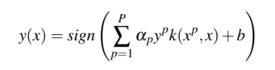
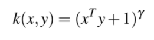
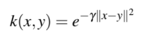

# Numpy SVM Impementation

## The Task

Implementation of a nonlinear Support Vector Machine classifier over images of handwritten digits from the MNIST database, with numpy and optimization with KKT conditions.

The SVM problem is given as follows:

Where `α, b` are obtained as the optimal solution of the dual nonlinear SVM problem, and kernel `k(,)` is the corresponding nonlinear decision function. Both polynomial and rbf kernels are implemented in this project. Their equations are as follows, respectively:

 

The polynomial kernel is set as the default.

## The Dataset

Each sample of the MNIST dataset is a 28x28 grayscale image, associated with a label. The only preprocessing required by this dataset is scaling. The dataset file has all the images, but only images belonging to labels 3 and 8 are used for the task in number 1 to 3, while label 6 is also added for the task in number 4. The test set is extracted as 20% of the data. 

All the configuration of the dataset can be changed in the `load_mnist()` function in the `utils.py` file. 

## Running the Code

Each `run_#.py` file is an implementation for the task described in the list below (`#` corressponds to each number):

1. `run_1.py` executes full minimization for the SVM dual quadratic problem using the cvxopt routine. To do a search over `C` and `gamma`, edit the search values in `run_grid_search.py` and run the script, then set the values in `run_1.py` and run it. The kernel used can also be changed between `polynomial` and `rbf`.

2. `run_2.py` implements a decomposition method to solve the SVM dual quadratic problem, with q set to 100 (this can be changed). Use the same `C` and `gamma` values from the grid search before.

3. `run_3.py` implements the Most Violating Pair (MVP) decomposition method to solve the SVM dual quadratic problem, with q set to 2, using the analytic solution of the subproblems. Use the same `C` and `gamma` values from the grid search before.

4. `run_4.py` executes a One-vs-All multi-class SVM over the dataset, for three classes (digits 3, 6, 8), executing full minimization for the SVM dual quadratic problem for each model.